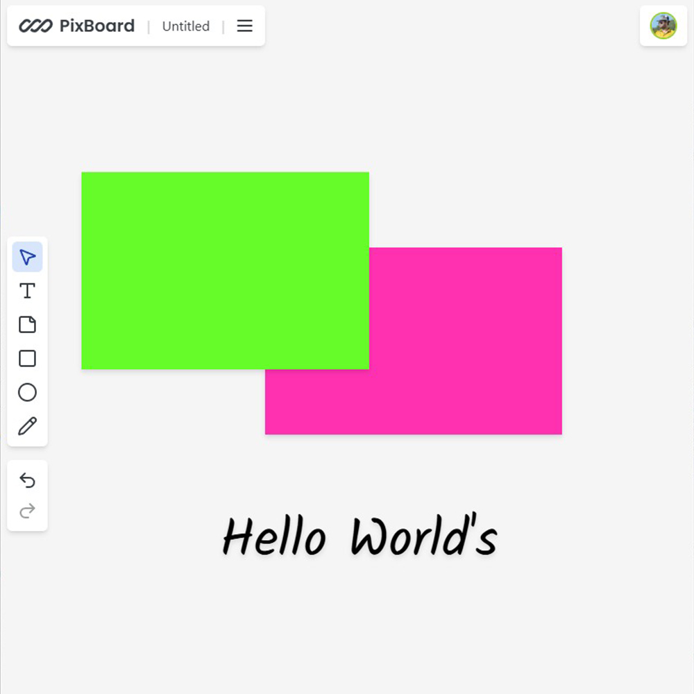

# Pixboard - Collaborative Whiteboard

The whiteboard app is a collaborative digital drawing tool built using a modern tech stack to provide real-time interactivity and secure user management.

This app represents a modern, collaborative tool that leverages the best of serverless technology, real-time communication, and responsive design, making it ideal for any collaborative or creative use case.

## Requirements

- Basic HTML, CSS & Javascript knowledge.
- Basic Next JS knowledge.

## How to Install & Run

To run the application, follow these steps:

1. Clone the repository or download it as a ZIP file.
2. In a terminal, navigate to the folder where the application is located.
3. Run the **npm install** command to install all the necessary dependencies.

```shell
npm install
```

4. Run the **npm run dev** command to start the application in development mode.

```shell
npm run dev
```

5. Open your browser and navigate to **http://localhost:3000** to use the application.

```shell
http://localhost:3000
```

## Application Features

Teachers and students can use the whiteboard for drawing diagrams, solving equations, or explaining concepts in real time.

- Ease of Use: Users can jump in, sign up, and start drawing immediately, with tools arranged intuitively.
- Robust Collaboration: Multiple people can join a session and draw simultaneously, with live updates and presence indicators enhancing the collaborative experience.
- High Scalability: Built to handle spikes in user activity, with serverless components that scale dynamically.
- Secure Access: Clerk ensures only authenticated users can access the app, keeping sessions safe and private.

## Technologies Used

This web app serves as a robust, interactive whiteboard solution suitable for both personal and collaborative drawing, brainstorming, and teaching scenarios.

- Convex - Acts as the real-time backend, handling data synchronization across sessions, allowing users to see updates and changes made by others instantly.
- Liveblocks - Enhances collaborative features by managing presence, cursors, and shared drawing tools, enabling multiple users to draw and interact in real-time with smooth, live updates.
- Next.js - Powers the frontend and server-side functionalities, making the app fast, scalable, and optimized for performance. Leveraging Next.js ensures the application is SEO-friendly and provides excellent performance with static and dynamic pages.
- Tailwind CSS - Used for designing a responsive and user-friendly UI with ease. Tailwind's utility-first classes help in crafting custom designs quickly without leaving the HTML file.
- Clerk Authentication - Manages user authentication with seamless integration for sign-in, sign-up, and account management. Clerk provides various options for secure and easy user authentication, improving the user experience and ensuring app security.

## Contribution

If you'd like to contribute to this project, feel free to submit a pull request. Before doing so, be sure to create a separate branch for your changes.

## Buy A Coffee

Like my works and want to support me?

<a href="https://www.buymeacoffee.com/hossainpalin" target="_blank"></a>

## Screenshots



## Live demo

Live previews are the best way for a better understanding of the application's user interface.

[Click here...](https://pixboard-team.vercel.app)
